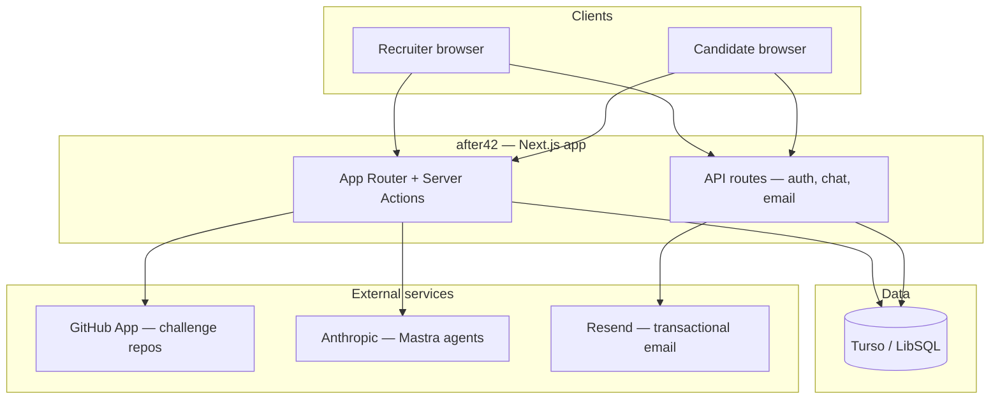
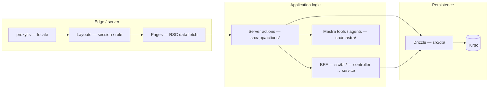
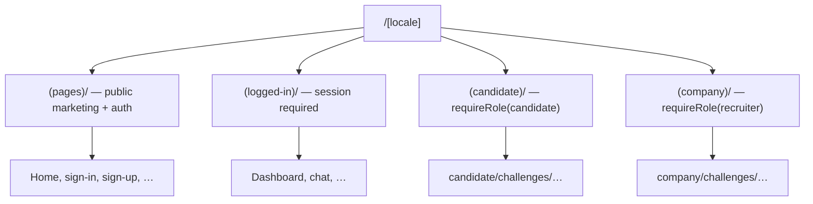
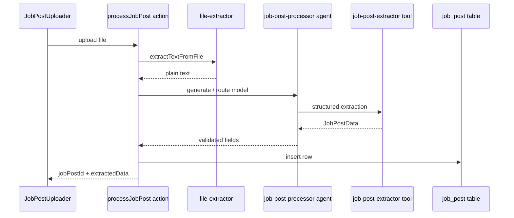
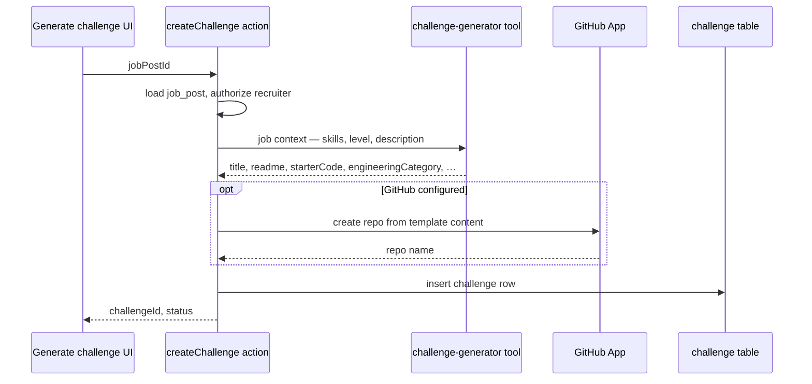
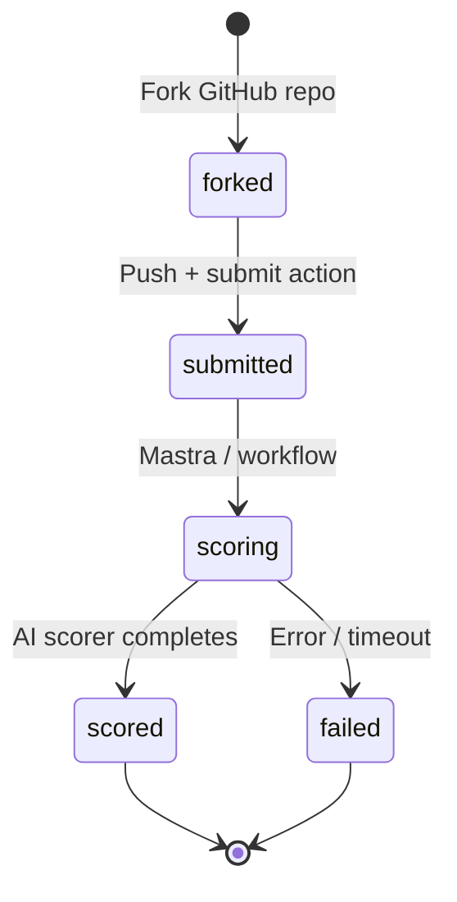
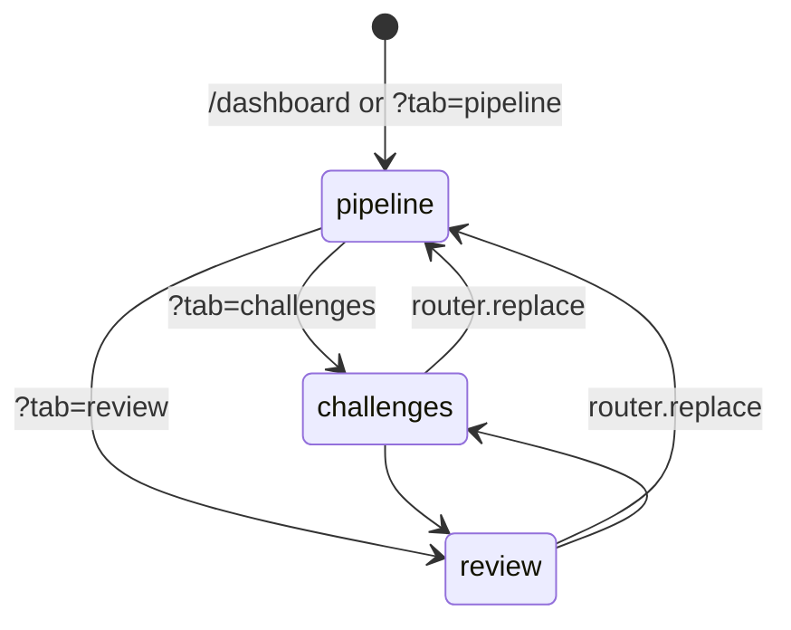

# Architecture

**after42** is a recruitment platform: recruiters upload job posts, AI extracts structured fields and generates coding challenges; candidates fork repos, submit work, and receive AI-assisted scoring. Recruiters review submissions under **blind review** rules (no direct candidate identity in company UI).

Extended stack and file pointers: [`CLAUDE.md`](../CLAUDE.md).

---

## System context

---

## Request path and layers

Localized pages live under `src/app/[locale]/`. The Next.js **proxy** (`src/proxy.ts`) applies `next-intl` locale routing so URLs always include a locale prefix (e.g. `/fr/dashboard`).

**Navigation rule:** use `Link`, `redirect`, `useRouter`, and `usePathname` from [`src/i18n/navigation.ts`](../src/i18n/navigation.ts), not from `next/link` or `next/navigation`, so locale is preserved.

---

## Route groups (mental model)

API routes under `src/app/api/` are **not** prefixed with locale.

---

## Job post extraction pipeline

---

## Challenge generation

`engineering_category` is chosen by the generator from a fixed enum and stored on `challenge` for recruiter dashboard display.

---

## Candidate fork → submit → score (simplified)

Company-facing APIs and UI must not expose `candidateId` or `githubForkName`; recruiters see `sequenceNum` as “Candidate #N”. See [DATA-MODEL.md](./DATA-MODEL.md).

---

## Recruiter unified dashboard tabs

Dashboard tab state is driven by the `tab` query parameter (`?tab=challenges`). Default is the pipeline view.

Implementation: [`RecruiterTabProvider` / `RecruiterTabNav`](../src/components/company/recruiter-tabs.tsx).

---

## Chat (job post assistant)

`POST /api/chat` streams responses via `@mastra/ai-sdk` to the **job-post-processor** agent with thread memory (`threadId` / `resourceId`). The chat UI lives under the logged-in area; see [`CLAUDE.md`](../CLAUDE.md) § Chat Streaming.

---

## Related files

| Topic | Primary files |
|-------|----------------|
| Auth | `src/lib/auth.ts`, `src/app/api/auth/[...all]/` |
| Role gates | `src/lib/require-role.ts`, `(candidate)` / `(company)` layouts |
| Job posts | `src/app/actions/job-post.ts`, `src/mastra/agents/job-post-processor.ts` |
| Challenges | `src/app/actions/challenge.ts`, `src/mastra/tools/challenge-generator-tool.ts` |
| Scoring | `src/app/actions/scoring.ts`, `src/mastra/workflows/score-submission.ts` |
