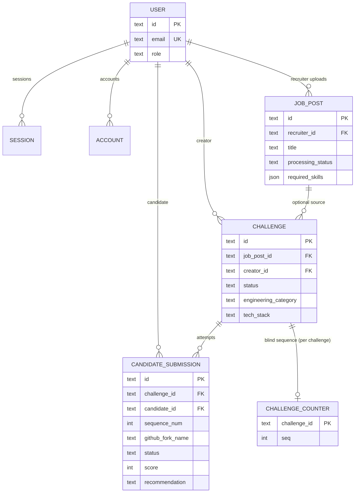

# Data model

Drizzle ORM with **SQLite (LibSQL / Turso)**. Schema sources live in [`src/db/schemas/`](../src/db/schemas/). Migrations are generated with `pnpm dbg` and applied with `pnpm dbm`.

---

## Entity relationship (domain + auth)

Better-auth owns `user`, `session`, `account`, and `verification`. Domain tables reference `user.id` by convention (`recruiterId`, `creatorId`, `candidateId`) where noted below.

---

## Blind review (company boundary)

These columns exist on **`candidate_submission`** but **must not** appear in recruiter-facing responses or UI:

- `candidateId`
- `githubForkName`

Recruiters see **`sequenceNum`** (e.g. “Candidate #3”), **`score`**, **`recommendation`**, structured **`aiReport`**, and **`interviewGuide`**. Enforced in server actions and page loaders when building company views.

---

## Submission status machine

Stored as string on `candidate_submission.status`:

| Value | Meaning |
|-------|---------|
| `forked` | Repo forked, work in progress |
| `submitted` | Candidate submitted |
| `scoring` | AI scoring in flight |
| `scored` | Score and recommendation available |
| `failed` | Scoring or pipeline error |

---

## Challenge lifecycle

`challenge.status`:

- `draft` — created; GitHub repo may be missing
- `active` — live for candidates (typical when repo exists)
- `closed` — no longer accepting work

---

## Profile tables (placeholder)

`programmer`, `recruiter`, and `company` are minimal profile extensions; most flows key off **`user.role`** (`candidate` | `recruiter`) and Better-auth session. See individual schema files under `src/db/schemas/`.

---

## JSON columns

| Table | Column | Purpose |
|-------|--------|---------|
| `job_post` | `required_skills`, `nice_to_have_skills`, `responsibilities` | Arrays from AI extraction |
| `challenge` | `challenge_content` | `{ readme, starterCode?, evaluationCriteria? }` |

---

## Indexes (high level)

- Submissions: by `challenge_id`, `candidate_id`, and score-oriented composite indexes where defined in schema
- Challenges: `job_post_id`, `creator_id`
- Sessions / accounts: `user_id`

Refer to [`src/db/schemas/`](../src/db/schemas/) for the authoritative definitions.
